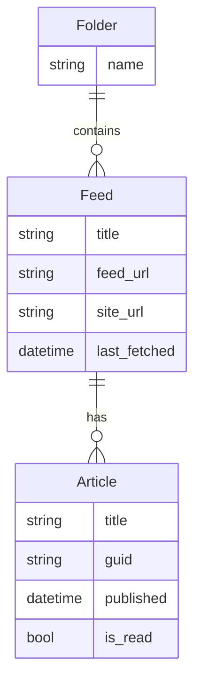
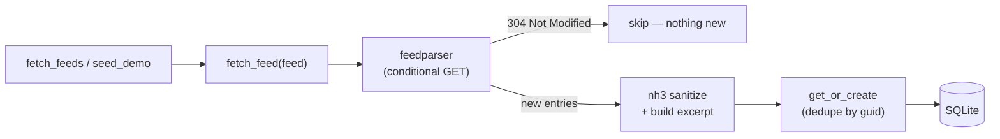
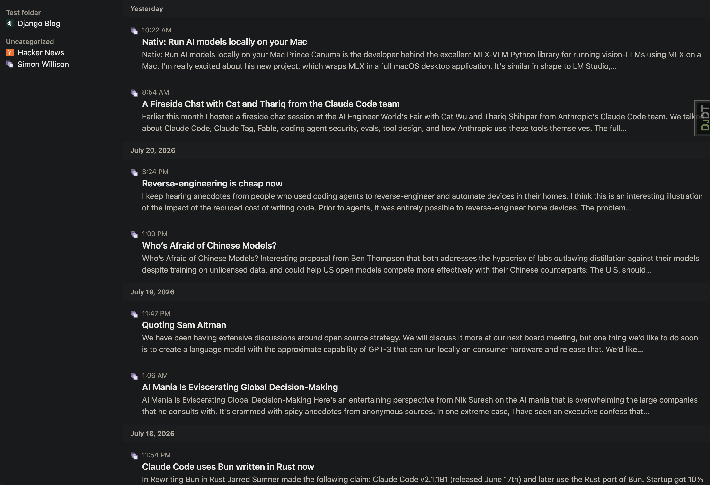
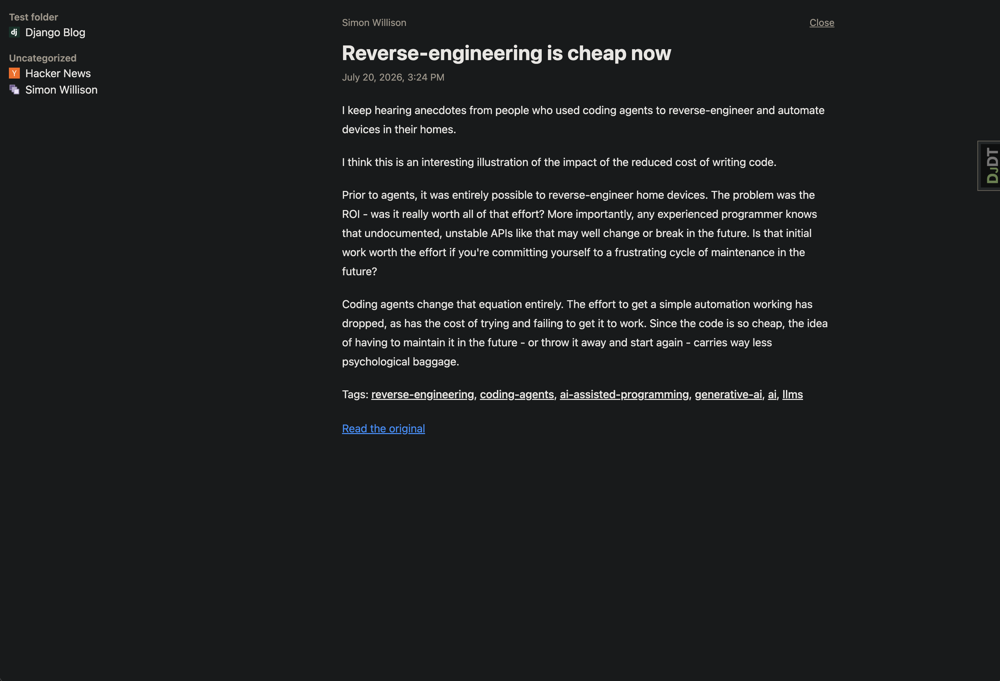

# Feed Reader

A single-user RSS/Atom feed reader built with Python and Django. Work-in-progress.

Live demo: [https://feed-reader-9jin.onrender.com/](https://feed-reader-9jin.onrender.com/) (read-only; first load may
be slow — free-tier cold start)

## Features

### Available now

- **Reading** — Unified "All Items" view, per-feed views, and a clean article reader with sanitized HTML and images
- **Organization** — Articles grouped by date ("Today", "Yesterday"), with favicons and per-feed grouping in the sidebar

### Planned

- **Feed management** — Currently admin-only. Add feeds by URL, autodiscover feeds from a site URL, organize feeds into
  folders, rename and delete
- **Read/unread tracking** — Toggle read state, mark all as read, and unread counts per feed
- **Search** — Filter the current view by keyword
- **Live interaction** — Read/unread toggles and on-demand refresh without full page reloads, via `htmx`
- **Background refresh** — Scheduled fetching of new articles

## Tech Stack

This is a deliberately Python-centric stack — no separate JS framework, no Node.js build step.

### In use

| Layer             | Technology                                                                           |
|-------------------|--------------------------------------------------------------------------------------|
| Language          | Python 3.13                                                                          |
| Framework         | Django 6.0                                                                           |
| Env / packages    | `uv` (env, dependencies, lockfile, Python version)                                   |
| Feed parsing      | `feedparser` (RSS + Atom)                                                            |
| HTML sanitizing   | `nh3`                                                                                |
| Styling           | Tailwind CSS v4 + typography plugin (`django-tailwind-cli`, standalone — no Node.js) |
| Database          | SQLite                                                                               |
| Production server | `gunicorn`                                                                           |
| Static files      | WhiteNoise                                                                           |
| Deployment        | Render (free tier)                                                                   |
| Testing           | Django `TestCase`                                                                    |
| Dev tooling       | `Ruff` (lint/format), `django-debug-toolbar`                                         |

### Planned

| Layer              | Technology                     | Purpose                                   |
|--------------------|--------------------------------|-------------------------------------------|
| Feed discovery     | `requests` + `BeautifulSoup`   | Autodiscover feeds from a site URL        |
| Interactivity      | `htmx` + `django-htmx`         | Partial page updates without full reloads |
| Background refresh | Django Tasks framework or cron | Scheduled feed fetching                   |

## Run Locally

Prerequisite: [uv](https://docs.astral.sh/uv/) installed — it manages the Python version, virtual environment, and
dependencies.

```bash
uv sync                                      # create the venv and install dependencies
uv run python manage.py migrate              # create the local SQLite database
uv run python manage.py tailwind runserver   # build CSS and start the dev server
uv run python manage.py fetch_feeds          # custom command: refresh all feeds
uv run python manage.py seed_demo            # custom command: populate demo feeds and fetch their articles
```

Then open `http://127.0.0.1:8000`.

Feeds and articles are managed through the Django admin. Create an account, then sign in at
`http://127.0.0.1:8000/admin/`:

```bash
uv run python manage.py createsuperuser
```

## Architecture





## Design inspiration

The UI for this project is loosely based on the iOS app [Reeder Classic](https://reederapp.com/classic/) and Google
Reader.

## Future enhancements

Stretch goals: full-text search, cached favicons, OPML import/export, and multi-user accounts.

## Screenshots


